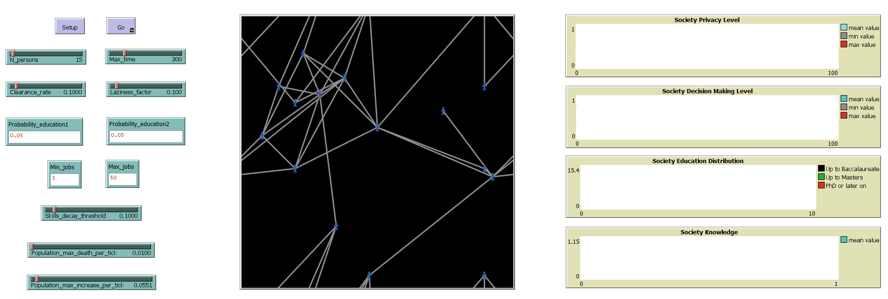

# Impact of AI on Human Knowledge — NetLogo Agent-Based Model

## Overview

This NetLogo model simulates the impact of artificial intelligence (AI) on the knowledge, structure, and evolution of a society of workers. It explores how AI adoption, social networks, policy interventions, spatial migration, and generational change interact to shape human knowledge, skills, privacy, and decision-making over time.

## Features

- **Agent-based simulation:** Each agent (person) has education, knowledge, privacy, and decision-making attributes.
- **Dynamic job market:** Jobs are created and deleted with varying education and AI requirements.
- **Social network:** Agents share knowledge and opportunities through links.
- **Skill decay and knowledge growth:** AI exposure and social learning affect agent skills.
- **Policy interventions:** Includes tax and universal basic income (UBI).
- **Spatial migration:** Agents move based on patch desirability.
- **Multi-generational system:** Reproduction and mortality modeled.

## How It Works

### Initialization

- Agents are created with random education, knowledge, privacy, and decision-making levels.
- Social networks are formed via links.
- Jobs are distributed on patches with education and AI requirements.

### Simulation Loop (each tick)

- Jobs are created and deleted.
- Agents are assigned to jobs if qualified.
- Knowledge is updated through work and social transfer.
- Skill decay may occur with high AI reliance.
- Agents may reproduce or die.
- Policy interventions (tax, UBI) are applied.
- Agents may migrate spatially based on desirability.
- AI adoption and decision-making are dynamically updated.

## How to Use

### Requirements

- Install, and run NetLogo 6.4.0 or newer

### Running the Model

1. Open `simulation_model.nlogo` in NetLogo.
2. Set parameters (population, job market, AI, policy) using sliders and input boxes.
3. Click **Setup** to initialize.
4. Click **Go** to run the simulation.

### Key Parameters

- `N_persons`: Initial number of agents
- `Probability_education1/2`: Education distribution
- `Min_jobs` / `Max_jobs`: Range of jobs per tick
- `Clearance_rate`: Job deletion rate
- `Laziness_factor`: Privacy erosion multiplier
- `Skills_decay_threshold`: Skill decay probability
- `Population_max_increase_per_tick` / `Population_max_death_per_tick`: Reproduction and death rates
- `Max_time`: Simulation duration

## Screenshots

### Key Plots
#### Society Privacy Level

#### Society Decision Making Level

#### Society Knowledge

#### Society Education Distribution

### Interface and Agent Characteristics
#### Model Interface

#### Person Characteristics Overview

#### Patch Characteristics Overview

## Things to Notice

- High AI usage can erode skills and privacy, especially for less-educated workers.
- Social learning helps preserve knowledge.
- Migration can lead to spatial clustering and inequality.
- Policy interventions (UBI, tax) can buffer vulnerable populations.

## Extending the Model

- Add more nuanced policies (e.g., AI regulation).
- Experiment with different social network structures.
- Refine migration or cognitive models.

## Credits

- Model author: Prince Foli Acouetey
- Inspired by NetLogo’s Wealth Distribution and Segregation models
- Special thanks: Perplexity AI, Data ScienceTech Institute

## License

This project is released under the MIT License.
